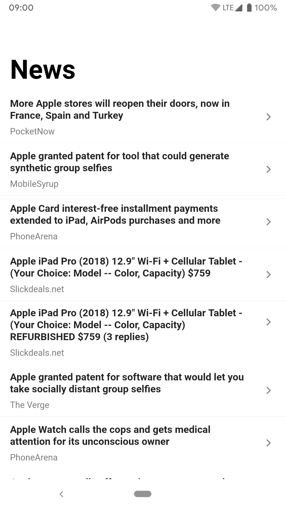
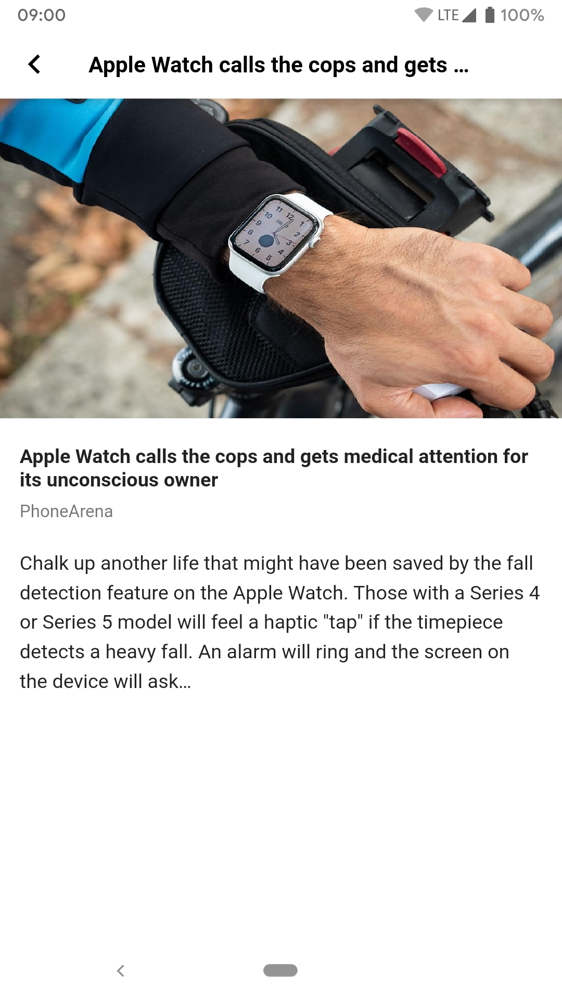

# NewsHub

A simple news app with some cool-looking animations.

*My solution to the QodeHub Internship Challenge*

#### Screenshots
 

#### GIF Demo

#### Video Demo
Click [here](https://vimeo.com/426843540) to watch a video demo of NewsHub in acton.
__*Please adjust the resolution if the video looks blurry*__

#### Download the APK
- [NewsHub arm64 - 64bit](https://drive.google.com/file/d/1qxj3Dm2GhqJW-ExjfShUXQsENOduGxX7/view?usp=sharing)
- [NewsHub armeabi - 32bit](https://drive.google.com/file/d/1SQlWZZNBN2pE8fJa4YNT9GnzwU2MB7_4/view?usp=sharing)

## How Does It Work?

#### Framework
NewsHub is built with the **Flutter SDK** in the **Dart** programming language. This allows NewsHub to be deployed on multiple platforms with the same codebase and minimal platform setup.

#### Backend
The app is powered by [this](https://learnappmaking.com/ex/news/articles/Apple?secret=CHWGk3OTwgObtQxGqdLvVhwji6FsYm95oe87o3ju) backend. The backend supplies a summary of 20 news articles in **JSON** format which includes data about the id, title, author, publisher, date, etc. of each article. 
This data is retrieved with the help of the [http package](https://pub.dev/packages/http) provided by the Flutter team.

Error checking and handling is implemented at various parts of the app because when dealing with any form of data transfer, *especially over the internet*, things can go wrong.

UI states are built for the various stages of data retrieval. These are the loading, error, empty and complete states.

#### Animations
The app utilizes various animations and transitions to give a better user experience. Some of these animations serve as **visual guides**, guiding the user's attention to the flow of the app. Others smoothen otherwise jarring state changes in the UI, for example the fade-in of the article's image once it is loaded.

Most of the animations are accomplished using in-built Flutter widgets and the [animations package](https://pub.dev/packages/animations) provided by the Flutter team.

##### P.S.
Feel free to clone and mess around. Pull requests are welcome. There's a lot of data from the backend that isn't being used as per the requirements of the challenge but they can make the app's UI richer.
